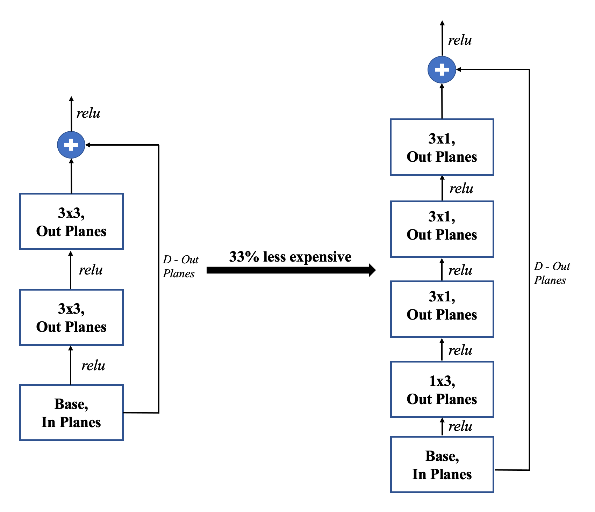

# Introduction to Deep Learning Project Repo.
## PSMNet Literature Replication 

A PSMNet model was developed based on the literature [[1]](#1).  This was used to generate disparity maps and they were tested based on the training L1 loss and validation 3-pixel accuracy.  The baseline PSMNet architecture from [[1]](#1) is shown in Figure 1.  

*PSMNet Literature Architecture*

## Modifications to the PSMNet model in literature

Three main modification to the architecture of the model were also tested. 

1. Less Convolutional layers
2. More Convolutional layers
3. Asymmetric Convolutions when the kernal size was large. 

These modifications to the literature PSMNet model all reached the same minima (at differing amounts of Epochs).  Figures for the changes in loss and accuracy are shown below in Figure 2 and Figure 3.  

*L1 Loss Experiments*

*3-pixel Accuracy Experiments*

The asymmetric convolutions idea was based on the paper "Rethinking the Inception Architecture for Computer Vision" [[2]](#2).  The inception paper has shown that for example using a 3x1 convolution followed by a 1x3 convolution is equivalent to sliding a two layer network with the same receptive field as in a 3x3 convolution.  This is shown in Figure 4.  It has been shown in the literature that the asymmetric convolutions are equivilant to sliding a two layer network with the same receptive field as in a 3x3 convolution.  This is illustrated in Figure 4.  The change to the basic block in the PSMNet architecture is shown in figure 5.  

Asymmetric Convolutions                                                                                                     |  Change in Basic Block Model Architectures 
:-------------------------:|:-------------------------:
*Mini-network replacing the 3x3 convolutions [[2]](#2)*  |  *Comparison between the original and the modified architecture with asymmetric convolutions*

## Model Code

1. [Baseline Model](Models/Baseline/11785_ProjMidterm_Baseline.ipynb)
2. [Other Modified Model Architectures](Models/Modified/11785_ProjMidterm_Parameter_Reduction.ipynb)
3. [Utils]()

## How to Run the Code

After installing any dependencies you may need go to the [Baseline Model](Models/Baseline/11785_ProjMidterm_Baseline.ipynb) and run each cell in order in the notebook.  The training should take about 11 and a half hours.  The accuracies and model will be saved automatically every 10 epochs.  

## References
<a id="1">[1]</a> 
Jia.-Ren Chang and Yong.-Sheng Chen (2018). 
Pyramid Stereo Matching Network
CoRR, abs/1803.08669, http://arxiv.org/abs/1803.08669

<a id="2">[2]</a> 
Christian Szegedy and
               Vincent Vanhoucke and
               Sergey Ioffe and
               Jonathon Shlens and
               Zbigniew Wojna (2015). 
Rethinking the Inception Architecture for Computer Vision 
CoRR, abs/1512.00567, http://arxiv.org/abs/1512.00567

