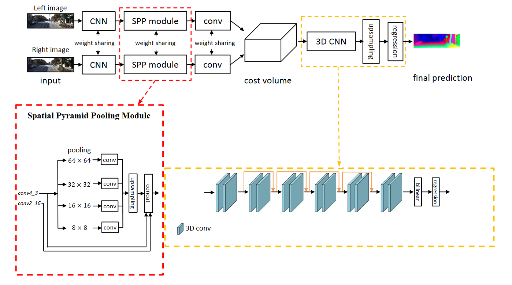
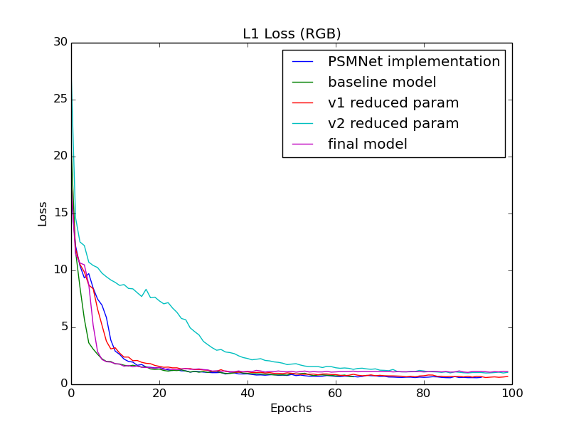
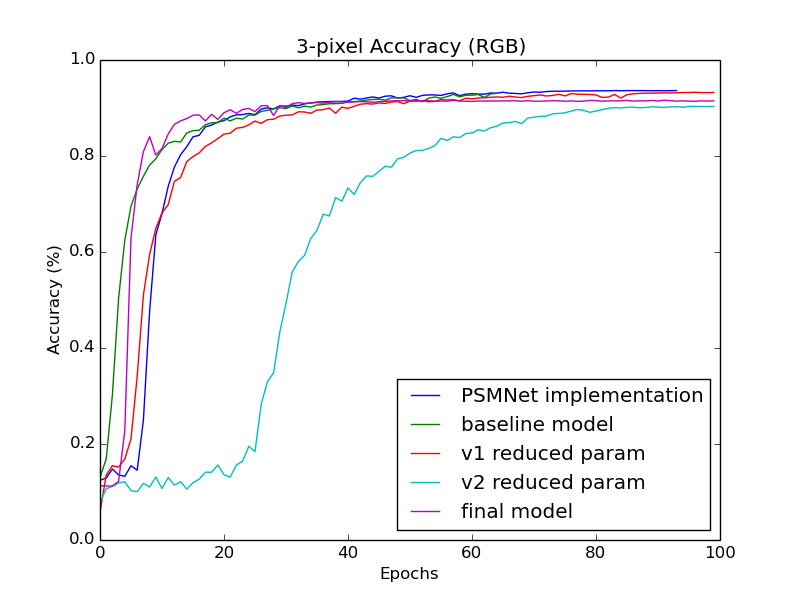
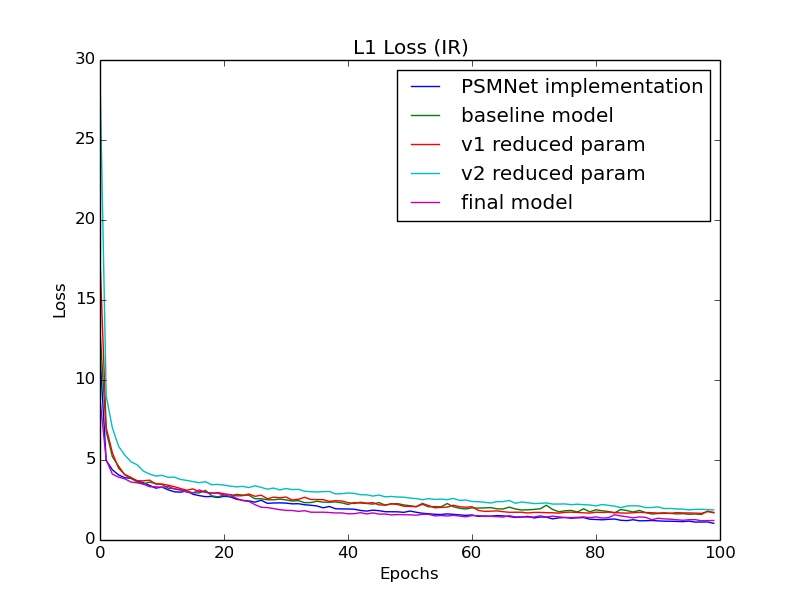
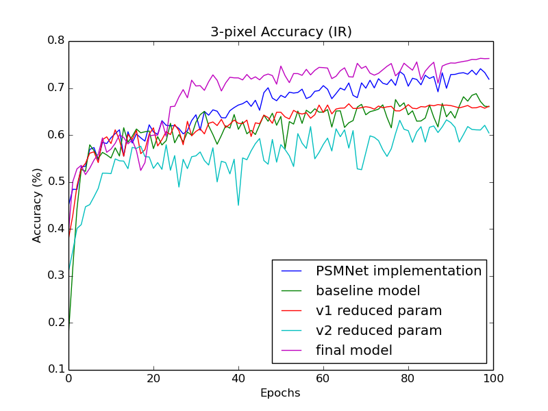
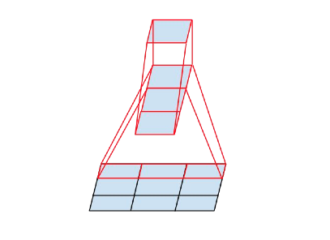

# Introduction to Deep Learning Project Repo

## How to Run the Code

Running the code is simplified by use of a python notebook. All that is required is to run each cell in the [Final Model IR](Models/Final/Final_Model_IR.ipynb) for IR data and [Final Model RGB](Models/Final/final_model_rgb.ipynb) for RGB data. The training should take about 4 hours for 100 epochs for the final model and 11 and a half hours for the baseline model. The accuracies and model will be saved automatically every 10 epochs.

## Model Code

1. [Final Model IR](Models/Final/psmreimp_ir(1).ipynb)
2. [Baseline Model](Models/Baseline/11785_ProjMidterm_Baseline.ipynb)
3. [Other Modified Model Architectures](Models/Modified/11785_ProjMidterm_Parameter_Reduction.ipynb)
4. [Utils](Utils/plot_util.py)
5. [Data](Utils/data)

## PSMNet Literature Replication 

A PSMNet model was developed based on the literature [[1]](#1).  This was used to generate disparity maps and they were tested based on the training L1 loss and validation 3-pixel accuracy.  The PSMNet architecture from [[1]](#1) is shown in Figure 1.  

*Figure 1: PSMNet Literature Architecture*

### Comparison of Results
We use the 3 pixel disparity error to evaluate our models and compare them against the original PSMNet [[1]](#1)performance.  A comparison of each model’s total number ofparameters used, error on the RGB dataset, and error on the IR dataset can be seen in Table

*Table 1: Performance Comparison*
| Name              |  Params. |RGB Error | IR Error |
| ----------------- | ------   | -------- | -------- |
| PSMNet            | 3.6 mil  | 6.4 %    | 25.9 %   |
| Our Model         | 3.1 mil  | 6.9 %    | 31.2 %   |
| v1 reduced param  | 2.77 mil | 6.7 %    | 33.3 %   |
| v2 reduced param  | 2.58 mil | 9.7 %    | 36.8 %   |
| Final model       | 1.77 mil | 8.4 %    | 23.7 %   |
#### Disparity error visualization, Top row is the generated disparity map, middle row is the GT,and the last row is the error visualized on the GT
#### RGB
<table>
  <tr>
    <td>Figure 2: Better Disprity map </td>
     <td>Figure 3: Worse Disparity Map</td>
  </tr>
  <tr>
    <td></td>
    <td></td> 
  </tr>
 </table>

#### IR
<table>
  <tr>
    <td>Figure 2: Better Disprity map </td>
     <td>Figure 3: Worse Disparity Map</td>
  </tr>
  <tr>
    <td></td>
    <td></td> 
  </tr>
 </table>

## Modifications to the PSMNet model in literature

Three main modification to the architecture of the model were also tested. 

1. Less Convolutional layers
2. More Convolutional layers
3. 2D and 3D asymmetric convolutions
4. New feature extraction Module 

These modifications to the literature PSMNet model all reached a close final loss/accuracy with the Final model being the one that achieved a higher accuracy then the PSMNet architecture and leading to our decision of proposing that model for the use on IR datasets.  Figures for the changes in loss and accuracy for RGB are shown below in Figure 4 and Figure 5.  Figures for IR are shown in Figure 6 and 7.
             Training                                              |                                        Validation
:-------------------------:|:-------------------------:
*Figure 4: L1 Loss Experiments with RGB Images*  |  *Figure 5: 3-pixel Accuracy Experiments with RGB Images*

|            Training                                              |                                        Validation|
:-------------------------:|:-------------------------:
*Figure 6: L1 Loss Experiments with IR Images*  |  *Figure 7: 3-pixel Accuracy Experiments with IR Images*

The asymmetric convolutions idea was based on the paper "Rethinking the Inception Architecture for Computer Vision" [[2]](#2).  The inception paper has shown that for example using a 3x1 convolution followed by a 1x3 convolution is equivalent to sliding a two layer network with the same receptive field as in a 3x3 convolution.  This is shown in Figure 8.  It has been shown in the literature that the asymmetric convolutions are equivilant to sliding a two layer network with the same receptive field as in a 3x3 convolution.  This is illustrated in Figure 8.  The change to the basic block in the PSMNet architecture is shown in figure 9.  

Asymmetric Convolutions                                                                                                     |  Change in Basic Block Model Architectures 
:-------------------------:|:-------------------------:
*Figure 8: Mini-network replacing the 3x3 convolutions [[2]](#2)*  |  *Figure 9: Comparison between the original and the modified architecture with asymmetric convolutions*

# Final Model (SPP Module Modifications)
Using the insight gained from the aforementioned IR experiments, we redesigned the SPP module of PSMNet using residual blocks as shown in Figure 10 such that performance could be improved on IR images. The modifications described in this section, while tested primarily on IR images, may be applicable to RGB images as well. However, for the sake of this work we consider the architecture’s performance on the more challenging problem of IR disparity estimation.

Similar to PSMNet, we first perform spatial pooling at scales4×4,8×8,16×16, and32×32. Theoutputs of each spatial pooling operation are sent to a convolutional block (CB) whose architecture isprovided in Figure 11a. Specifically CB1 accepts 3 feature maps from the provided image and outputs 32 feature maps. The outputs from CB1 are passed to a series of 4 identity blocks. The design of each identity block (IB) is shown in Figure 11b. Note that the number of feature maps is unchanged by the identity block. The outputs of the identity block are passed through another set of convolutional (CB2) and identity (IB2) blocks. In the figure, CB2 accepts 32 feature maps and outputs 64 maps.  The outputs from each spatial pooling branch are upsampled to a common size, concatenated, and passed through a final set of convolutional and identity modules.  In Figure 10, CB3 takes in 512 feature maps and outputs 128 maps, while CB4 contains 64 filters. The final Conv layer contains 32 filters and performs a convolution with kernel size and stride both set to 1×1.

*Figure 10: Modified SPP Module*

*Figure 11a: Convolutional Block (CB) Diagram: N, M are the number of incoming and outgoing feature maps respectively*
*Figure 11b: Identity Block (IB) Diagram: N is the number of incoming feature maps*

## References
<a id="1">[1]</a> 
Jia.-Ren Chang and Yong.-Sheng Chen (2018). 
Pyramid Stereo Matching Network
CoRR, abs/1803.08669, http://arxiv.org/abs/1803.08669

<a id="2">[2]</a> 
Christian Szegedy and
               Vincent Vanhoucke and
               Sergey Ioffe and
               Jonathon Shlens and
               Zbigniew Wojna (2015). 
Rethinking the Inception Architecture for Computer Vision 
CoRR, abs/1512.00567, http://arxiv.org/abs/1512.00567

