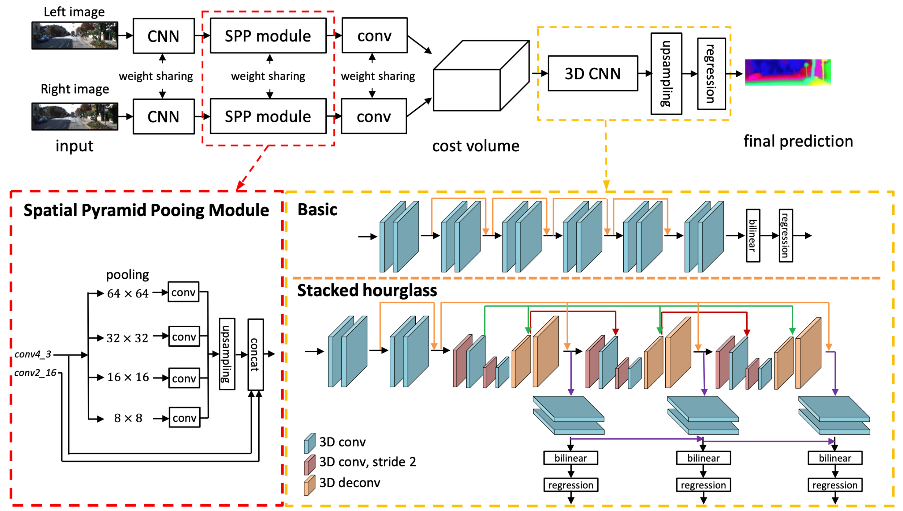

# Introduction to Deep Learning Project Repo

## How to Run the Code

Running the code is simplified by use of a python notebook. All that is required is to run each cell in the [Baseline Model notebook](Models/Baseline/11785_ProjMidterm_Baseline.ipynb). The training should take about 11 and a half hours for 100 epochs for the baseline model. The accuracies and model will be saved automatically every 10 epochs.

## Model Code

1. [Baseline Model](Models/Baseline/11785_ProjMidterm_Baseline.ipynb)
2. [Other Modified Model Architectures](Models/Modified/11785_ProjMidterm_Parameter_Reduction.ipynb)
3. [Utils](Utils/plot_util.py)
4. [Data](Utils/data)

## PSMNet Literature Replication 

A PSMNet model was developed based on the literature [[1]](#1).  This was used to generate disparity maps and they were tested based on the training L1 loss and validation 3-pixel accuracy.  The baseline PSMNet architecture from [[1]](#1) is shown in Figure 1.  

*Figure 1: PSMNet Literature Architecture*

### Comparison of Results
We use the 3 pixel disparity error to evaluate our models and compare them against the original PSMNet [[1]](#1)performance. The comparison can be seen in Table 1. The key thing to note here is that the authors in the PSMNet [[1]](#1) had leveraged the Sceneflow dataset which consists of 35,454 train synthetic stereo pair images and then use the KITTI dataset to fine-tune the model and perform the evaluation, whereas in this paper we have only used the KITTI 2012 and 2015 datasets which combined have only 315 train images. Thus the dataset under consideration is an order of magnitude smaller.  The authors train their model on 4 Nvidia Titan XP's for 10 epochs on the sceneflow dataset and then fine-tuned it on the KITTI for over 1000 epochs , whereas we were able to achieve our current results in ~65 epochs at the maximum on 1 Tesla T4 and the models are still training and improving.  We expect that with more training we would achieve results quite similar to the original implementation. The output disparity maps, with the ground truth and the error visualizations can be seen in Figure 2 and 3.

*Table 1: Performance Comparison*
| Name      |  Error |
| --------- | ------ |
| PSMNet    | 2.32 % |
| Our Model | 6.8 %  |

#### Disparity error visualization, Top row is the generated disparity map, middle row is the GT,and the last row is the error visualized on the GT

<table>
  <tr>
    <td>Figure 2: Disparity Error: 2.62% </td>
     <td>Figure 3: Disparity Error: 8.26</td>
  </tr>
  <tr>
    <td></td>
    <td></td> 
  </tr>
 </table>

## Modifications to the PSMNet model in literature

Three main modification to the architecture of the model were also tested. 

1. Less Convolutional layers
2. More Convolutional layers
3. Asymmetric Convolutions when the kernal size was large. 

These modifications to the literature PSMNet model all reached the same minima (at differing amounts of Epochs).  Figures for the changes in loss and accuracy are shown below in Figure 4 and Figure 5.  
             Training                                              |                                        Validation
:-------------------------:|:-------------------------:
*Figure 4: L1 Loss Experiments*  |  *Figure 5: 3-pixel Accuracy Experiments*

The asymmetric convolutions idea was based on the paper "Rethinking the Inception Architecture for Computer Vision" [[2]](#2).  The inception paper has shown that for example using a 3x1 convolution followed by a 1x3 convolution is equivalent to sliding a two layer network with the same receptive field as in a 3x3 convolution.  This is shown in Figure 6.  It has been shown in the literature that the asymmetric convolutions are equivilant to sliding a two layer network with the same receptive field as in a 3x3 convolution.  This is illustrated in Figure 6.  The change to the basic block in the PSMNet architecture is shown in figure 7.  

Asymmetric Convolutions                                                                                                     |  Change in Basic Block Model Architectures 
:-------------------------:|:-------------------------:
*Figure 6: Mini-network replacing the 3x3 convolutions [[2]](#2)*  |  *Figure 7: Comparison between the original and the modified architecture with asymmetric convolutions*

## Future work and Timeline
From the preliminary experiments discussed above, we propose updating the timeline as follows. From 11/10 to 11/17 we plan to complete implementing a more efficient stacked hourglass version of PSMNet that achieves competitive performance on the disparity estimation problem given RGB images. Using the stacked hourglass version, we also plan to conduct preliminary experiments on IR stereo images and compare the results with those of RGB stereo images. From 11/17 - 11/24 we plan to implement architectural changes within the stacked hourglass model to improve performance on IR images. Ideally, the design modifications should enhance the model's capabilities on IR data without affecting the performance on RGB stereo images. We reserve the remaining time after 11/24 until the preliminary report submission deadline of 12/8 to continue refining and improving the performance of the modified stacked hourglass model we develop. The updated timeline is summarized in Figure 8 below.

*Figure 8: Timeline for the remainder of the Deep Learning Project*

## References
<a id="1">[1]</a> 
Jia.-Ren Chang and Yong.-Sheng Chen (2018). 
Pyramid Stereo Matching Network
CoRR, abs/1803.08669, http://arxiv.org/abs/1803.08669

<a id="2">[2]</a> 
Christian Szegedy and
               Vincent Vanhoucke and
               Sergey Ioffe and
               Jonathon Shlens and
               Zbigniew Wojna (2015). 
Rethinking the Inception Architecture for Computer Vision 
CoRR, abs/1512.00567, http://arxiv.org/abs/1512.00567

